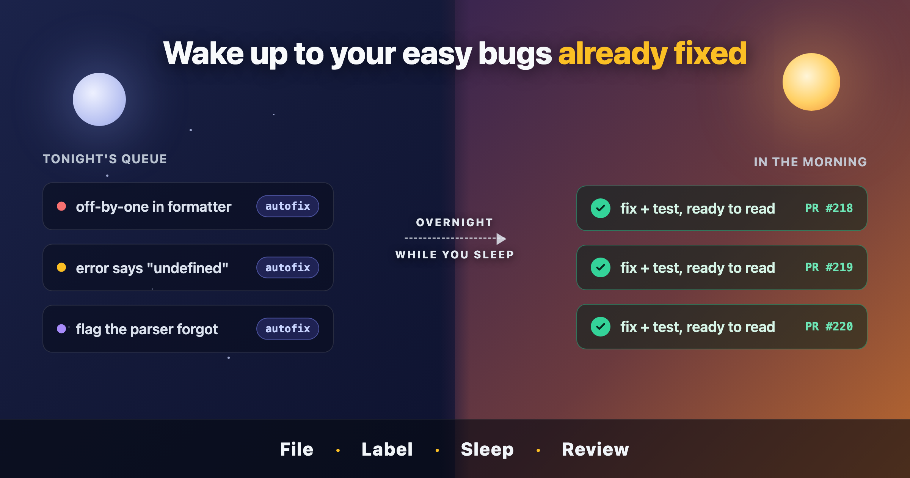

# Wake up to your easy bugs already fixed

Every backlog has a graveyard.

It's the pile of small, real, genuinely annoying bugs that nobody has the evening
to fix. The off-by-one in the date formatter. The error message that says
"undefined" instead of the filename. The flag that the docs promise but the parser
forgot. None of them are hard. Every one of them is real. And every one of them has
been sitting there for three months, because the work that pays the rent always wins
the calendar.

You know the ones. You've triaged them, labeled them, maybe even apologized to the
person who reported them. And then you closed the tab, because there was a feature to
ship. They're not hard enough to be interesting and not important enough to be urgent,
which is exactly the combination that means they never get done.

What if that graveyard emptied itself overnight?

Not magically. Not by some model silently rewriting your codebase while you sleep and
hoping you don't notice. I mean something much more boring and much more useful: you
label the easy bugs at the end of the day, you go home, and in the morning each one
has a pull request waiting — written, tested, and sitting there for you to read over
coffee. You merge the good ones. You close the tab on the bad ones. The graveyard
shrinks while you sleep.

That's the whole pitch. Let me show you how it feels to use, and then I'll tell you
the one decision that makes it something you'd actually trust.

## The everyday loop

Here's the entire workflow. There are no dashboards to learn and no new place to
live. It runs on the one tool you already use to track bugs: a label.

**You file the bug like you always do.** A GitHub issue, a sentence or two, maybe a
stack trace. Nothing changes about how you report problems. Keep the ones you queue
small and well-scoped — this is for the graveyard, not for the rewrite you've been
dreaming about. A good candidate is the kind of bug you could explain to a new
teammate in two sentences and they'd know where to look.

**You queue it with a label.** Add `autofix` to any issue you want handled. Label
one. Label twenty. They become tonight's queue. That label is the entire interface —
the on-switch, the to-do list, and the status board, all in one word you already know
how to apply. There's no separate system to keep in sync with reality, because the
label lives on the issue itself.

**You go home.** At the end of the day you kick off a session and leave it running.
It walks the queue one issue at a time. For each one it works out the smallest correct
fix, proves the fix actually holds, and opens a pull request. Then it moves to the
next. If an issue turns out to be too vague, or the fix can't be made to pass, it
doesn't stop the whole run and it doesn't guess — it sets the issue aside, flags it
for you, and keeps going. One bad issue at position three doesn't strand the seventeen
behind it. The queue drains regardless, and a vague bug costs you nothing but the
label you spent on it.

**You review in the morning.** Each fixed issue now has exactly one pull request open,
and the issue is relabeled so you can see at a glance what happened overnight. You read
the diffs. The ones you like, you merge — and merging closes the original issue
automatically, because each pull request is wired to the issue it fixes. The ones you
don't, you close or send back. Anything the tool couldn't satisfy is flagged for a
human, which is to say, for you, when you have a minute.

That's it. File, label, sleep, review. The interesting part isn't any single step —
it's what the system refuses to do in between.

## The twist that makes it usable

Here is the most important sentence in this whole project:

**It never merges, and it never closes your issues.**

Read that again, because it's doing more work than it looks like. An agent that runs
unattended against your repository overnight, touching real code, opening real pull
requests — and it has been deliberately built so that it cannot put a single line into
your main branch on its own. It stops at the pull request. Every time. The merge
button stays yours.

This is not a limitation I apologize for. It's the point.

Think about what the alternative actually asks of you. "AI that fixes your bugs and
merges them automatically" sounds like more automation, but it's really asking you to
trust a probabilistic system, unsupervised, with write access to the thing your
livelihood runs on. The first time it's confidently wrong — and it will be confidently
wrong, because that's what these systems do — it's already in your main branch. Now
you're not reviewing a proposal. You're doing forensics: bisecting, reverting,
explaining to your team why the deploy went sideways at 2am for a bug that wasn't even
on fire.

By stopping at the pull request, the system inverts that. It does the boring,
time-consuming first draft — the part that was keeping those bugs in the graveyard —
and then it hands you a diff and gets out of the way. You're not babysitting a robot.
You're reviewing a junior colleague's work, except the junior colleague worked through
the night and never got bored, never got distracted, and never skipped writing the
fix because there was a feature to ship.

The division of labor is the design. The machine is good at the tireless, repetitive,
low-creativity work of producing a candidate fix and checking that it holds. You are
good at judgment — at knowing whether this is the *right* fix, whether it fits the
shape of the codebase, whether the bug was even worth fixing this way. Most "autonomous"
tools blur that line and ask you to trust the machine with the judgment too. This one
draws it sharply and on purpose, and that's exactly why you can leave it running.

## What you're actually getting

When you wake up, you're not getting a pile of speculative code to audit from scratch.
You're getting a small set of pull requests with some properties that took real
engineering to guarantee — and that I'll spend the next two posts unpacking.

Each pull request was built and tested in its own isolated copy of your project, fully
set up to actually run, so "tested" means the fix was really executed against your
project's own checks, not just plausibly typed. Your working checkout was never
touched — you could have been coding in it the whole time the session ran, on a branch
of your own, none the wiser.

And the pull requests don't step on each other. If the queue fixed eight bugs
overnight, you get eight pull requests you can merge in any order, in any combination,
without them fighting over the same files. You can merge three today and the rest on
Friday, and none of them will surprise you with a conflict that wasn't there when they
were opened. That sounds like a small thing until you imagine the alternative: eight
overlapping branches that each assume they're the only change, and a morning spent
rebasing instead of reviewing.

That property — independent, conflict-free pull requests produced by work happening in
parallel — does not happen by accident. It's a guarantee designed into the pipeline,
and it's the kind of thing that separates a weekend demo from something you'd let near
your repository. But that's the next post.

## Why the restraint is the whole story

It would be easy to read all of this as a tool that does less than it could. It refuses
to merge. It refuses to close issues. It refuses to guess at vague bugs. It sets things
aside instead of pushing through.

Every one of those refusals is a feature.

The reason you can label twenty issues and go home is precisely that the system has been
designed around its own fallibility instead of pretending it has none. It assumes it
will sometimes be wrong, and it arranges the world so that being wrong is cheap: an
unmerged pull request you simply close, an issue it set aside for you to clarify, a
test that failed loudly in an isolated sandbox instead of silently in your main branch.
Confidence, here, comes from constraint. The narrow scope is what makes the autonomy
safe enough to use, and the safety is what makes the narrow scope worth having.

That's the thread running through everything I'll write about this project. Anyone can
prompt a model to "fix this bug" and get something that compiles. The actual skill —
the engineering — is building the system *around* that model so its output is
trustworthy enough to use while you're asleep. The intelligence is the easy part. You
can rent it by the token. The trust is the part you have to design, and it's the only
part that matters once the novelty wears off.

In the next post, I'll open the hood and show you how that trust gets built: the
isolated, runnable sandboxes where every fix has to prove itself before anyone believes
it, and the mechanism that lets a dozen fixes happen in parallel and still arrive as a
dozen pull requests that never collide.

For now, the offer is simpler than the engineering behind it. You have a graveyard of
small bugs. Label the easy ones. Go home. The boring first drafts will be waiting for
you in the morning, and the only thing left for you to do is the part you're actually
good at: deciding.
