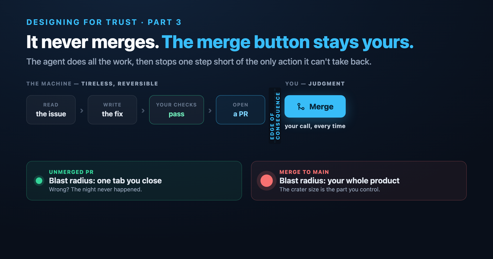

# Never merge: designing an autonomous agent you can actually trust

The scariest sentence in AI tooling is four words long: *"and then it commits."*

Everything before those words can be impressive. The agent read the issue, understood
the bug, navigated an unfamiliar codebase, wrote a clean fix, ran the tests. Genuinely
remarkable. And then it commits to main, and every bit of that impressiveness curdles
into risk, because now a system that is wrong a predictable fraction of the time has
write access to the one branch you can't afford to be wrong about.

When I built an agent to fix bugs unattended overnight, the most important decision I
made was not a capability. It was a refusal. The agent never merges, and it never closes
your issues. It does all the work, and then it stops — deliberately, permanently, by
design — one step short of the only action it can't take back.

This post is about why that refusal is the most important engineering in the whole
system, and what it taught me about how trust in autonomous software actually gets
built.

## Trust is not a feeling you earn by being smart

There's a tempting and wrong model of how to make an autonomous agent trustworthy: make
it better. Smarter model, sharper prompts, more context, higher accuracy. Get the error
rate low enough and surely, eventually, you can let it merge.

This is a trap, and it's worth being precise about why.

The error rate of these systems is never zero. You can push it down, but you cannot push
it to zero, and — this is the part that kills the "just make it smarter" plan — the
errors that survive are the *confident* ones. The model isn't uncertain when it's wrong.
It hands you a fix that looks right, reads right, and is wrong in a way that requires
your judgment to catch. So "high accuracy" doesn't actually earn the right to skip
review. It just makes the failures rarer, stranger, and better-disguised — which is to
say, more dangerous, because rare confident errors are exactly the ones you stop watching
for.

If you can't make the failures impossible, the entire question changes. It stops being
"how do I trust the agent's output" and becomes "how do I arrange things so that a wrong
output is cheap." You don't build trust by making the agent right. You build it by making
the agent *safe to be wrong*. Those are completely different engineering problems, and
only the second one is solvable.

## Trust is built from boundaries

So you design the boundaries instead of chasing the accuracy. Three of them, in this
system, and each one exists to make a mistake survivable rather than to make it
impossible.

**The agent only proposes.** It stops at the pull request, every time. The single most
consequential, least reversible action in the whole workflow — putting code into your
main branch — is the one action the agent structurally cannot take. Everything it does
is a proposal sitting in a pull request, which is the most reviewable, most revertible,
most *normal* artifact in your existing workflow. There's no special "AI review" you have
to learn. It's just a pull request, and you already know exactly what to do with one of
those: read it, and decide.

**It only ships what reality has approved.** A pull request opens only if your project's
own checks pass — not a generic notion of correctness, but *your* tests, *your*
type-checker, *your* build, run in a real environment built for the purpose. The model's
confidence in its own fix is worth nothing here; it's not the gate. The gate is whether
the thing actually passed the bar your project already sets for human contributors.
That's the difference between an agent that believes itself and one that has to earn its
place against the same checks you'd hold a colleague to.

**The human is the merge gate, and that's non-negotiable.** Not a setting. Not a "you
can disable this in config." The division of labor is the architecture: the machine
produces candidates and proves they pass; you decide what becomes real. The agent's job
ends exactly where consequence begins, and yours begins exactly there. Every autonomous
action it takes is, by construction, reversible — close the pull request and it's as if
the night never happened — because the one irreversible action was reserved for you.

None of these three is about making the agent smarter. Every one is about shrinking what
a mistake can cost. That's the move. That's the whole philosophy in one line: **you don't
make the agent trustworthy, you make its mistakes cheap.**

## Blast radius is the real design variable

Here's the mental model I kept coming back to, and the one I'd hand to anyone designing
autonomous software: stop optimizing the probability of error and start optimizing the
*cost* of error. The thing you are actually designing is the blast radius.

A merge to main is a blast radius the size of your whole product. An unmerged pull
request is a blast radius the size of one tab you close. Same wrong fix, same model, same
error — the only thing that changed is the size of the crater, and the size of the crater
is the part you control. That's the entire game. You will never win the fight to make the
agent never wrong. You can completely win the fight to make "wrong" not matter.

Notice what this buys you, because it's almost paradoxical: *the constraint is what
enables the autonomy.* The reason you can label twenty issues and walk away — the reason
the overnight, unattended, hands-off part is safe at all — is precisely that the agent
can't merge. Take the constraint away, let it merge "when it's confident," and you could
no longer leave it alone. You'd have to supervise it, because the cost of an unsupervised
mistake just went from a closed tab to a production incident. The leash is what lets the
dog off the leash. Remove the boundary in the name of more autonomy and you get less,
because now someone has to watch.

This is the counterintuitive heart of it. People think safety and autonomy trade off
against each other — that a safer agent is a more limited one. It's the reverse. The
boundary is the thing that makes the freedom usable. Confidence comes from constraint.

## What this says about where we're going

It's fashionable to frame agentic coding as a march toward removing the human — each
release a little more autonomous, the human a little more vestigial, until one day the
loop closes and we're not needed. I think that framing is wrong, and this project is a
small argument for why.

The future this points at isn't "no humans." It's humans doing a different job. The
tireless, repetitive, low-judgment work — producing the candidate fix, setting up the
environment, running the checks, proving the thing holds — moves to the machine, where it
belongs, because the machine is genuinely better at being tireless than you are. And the
work that's actually yours — judgment, taste, deciding whether this is the *right* fix and
whether it should exist at all — stays with you, sharpened, because now it's *all* you're
doing. You stop typing the boring fixes and start reviewing them. You move up the stack
from author to editor.

That's not a diminished role. For the small, well-scoped bugs this system handles, it's a
strictly better one: you keep all the judgment and shed all the drudgery. And the design
job — the actual skill in building these systems — is drawing that line in exactly the
right place. Too far one way and you've built a toy that asks permission for everything
and saves you nothing. Too far the other and you've built something that commits to main
and demands the supervision it was supposed to spare you. The art is in the placement.

The measure of a good autonomous system, I've come to think, isn't how much it can do
without you. Plenty of systems can do plenty without you; that's not hard and it's not the
point. The measure is how cleanly it hands control *back* — how reliably it stops at the
edge of consequence and says, *here, this part is yours.*

The agent never merges. That's not the feature I forgot to build. It's the one I built
the whole system around.
